# mini-projet-5esgi : Déploiement des application de IC Group

### Objectifs
Ce projet a pour objectifs de conteneuriser, configurer et déployer les applications du IC Group dans un cluster Kubernetes tout en assurant la persistance des données des différentes ressources.

- Odoo 13.0 : ERP open source
- gAdmin 4 : Interface Web d'administration pour PostgreSQL
- Application web développer avec Flask permettant l'accès aux deux services ci-dessus.

### Prérequis 
- Un cluster Kubernetes fonctionnel
- kubectl installé et configuré
- Docker installé pour build et push les images
- Accès à Docker Hub
- Git

## Architecture
L’architecture déployée repose sur trois composants principaux, chacun dans un conteneur Kubernetes au sein du namespace icgroup. Le premier est PostgreSQL, qui sert de base de données relationnelle pour stocker toutes les données métiers. Il est exposé en interne via un Service Kubernetes nommé postgresql-service, ce qui permet à d'autres pods du namespace d'y accéder via le DNS interne. Le second composant est Odoo, une application web de gestion d'entreprise, qui se connecte à PostgreSQL pour lire et écrire des données ; son déploiement inclut un volume persistant pour conserver les fichiers entre les redémarrages, et il est exposé à l’extérieur via un NodePort (port 30090). Enfin, pgAdmin est un outil d’administration de PostgreSQL déployé pour permettre aux développeurs ou administrateurs de visualiser et gérer la base de données via une interface web (sur le port 30091). Chaque composant a un volume dédié pour la persistance, et les accès sont sécurisés via des utilisateurs distincts dans PostgreSQL.

### Clonage du dépôt
```bash
git clone https://github.com/drsbvb/mini-projet-5esgi.git
```

## Deploiement de ic-webapp avec Docker

### Création d'un DockerFile
```bash
# Image de base
FROM python:3.6-alpine

# Définit le répertoire de travail
WORKDIR /opt

# Copie les fichiers de l’application dans l’image
COPY . .

# Installe Flask version 1.1.2
RUN pip install flask==1.1.2

# Expose le port 8080
EXPOSE 8080

# Définit les variables d’environnement
ENV ODOO_URL="https://www.odoo.com"
ENV PGADMIN_URL="https://www.pgadmin.org"

# Lance l’application
ENTRYPOINT ["python", "app.py"]
```
### Test du DockerFile
Pour commencer, il faut build l'image qu'on a crée avec notre Dockerfile avec la commande :
```bash
docker build -t ic-webapp:1.0
```

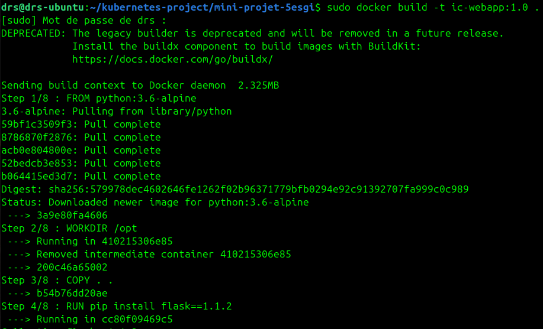


On peut vérifier que l'image s'est correctement build avec la commande :
```bash
docker image ls
```

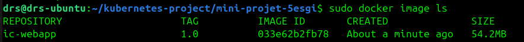

Puis lancer la création de l'application conteneurisée :
```bash
docker run -d --name test-ic-webapp -p 8080:8080 -e ODOO_URL="https://www.odoo.com" -e PGADMIN_URL="https://www.pgmain.org" ic-webapp:1.0
```
Pour vérifier que le conteneur s'est bien créé, on utilise la commande docker suivante :
```bash
docker ps -a
```

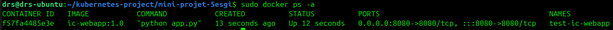

On peut voir que le conteneur est bien en running, on va pouvoir tenter d'accéder à sa page web afin de vérifier son bon fonctionnement.
```bash
http://172.180.0.29:8080
```

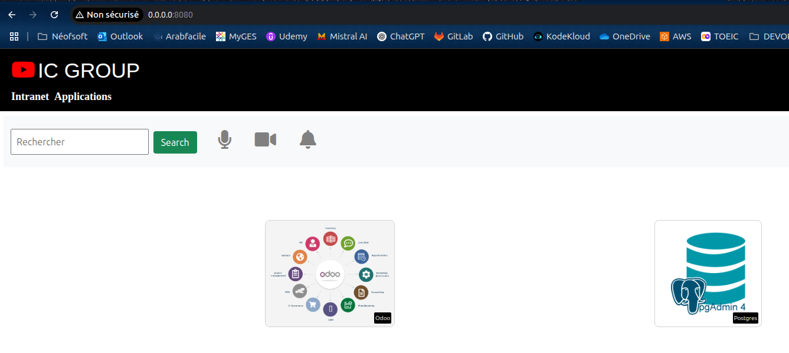

On peut essayer d'accéder la page odoo :

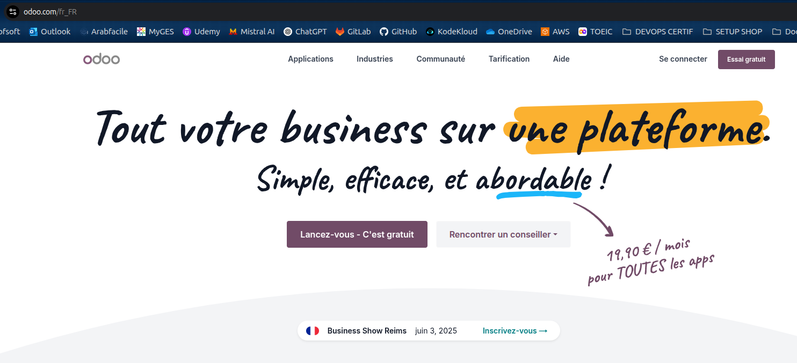

Notre image est bien fonctionnelle, on va pouvoir créer un tag et push l'image vers notre compte Docker Hub :
```bash
docker login
docker tag ic-webapp:1.0 kbysh01/ic-webapp:1.0
docker push kbysh01/ic-webapp:1.0
```

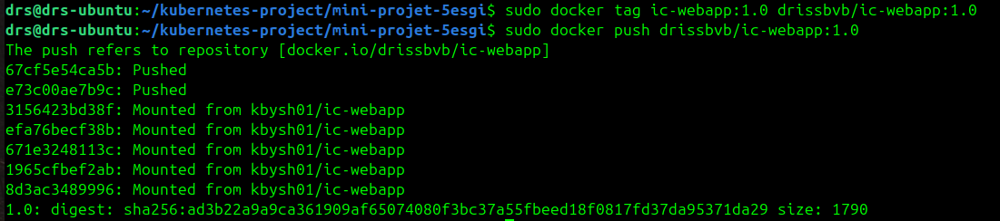

On peut vérifier que le push a bien été effectué en accédant directement à l'interface DockerHub :

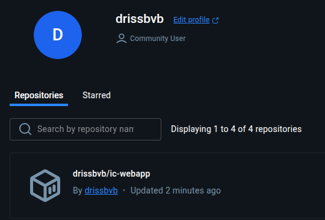

On peut ensuite stopper et supprimer le conteneur de test avec les commandes docker suivantes :
```bash
docker stop <container id>
docker rm <container id>
```
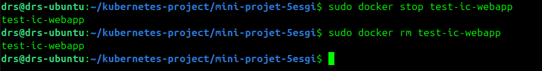

## Déploiement des ressources Kubernetes

Voici les fichiers manifests utilisés dans cette partie :

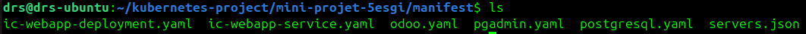

### Deploiement de l'application web
```bash
## Création d'un namespace pour isoler nos ressources
kubectl create ns icgroup 
  
## Déploiement de l'apprlication web (Deployment et Service)
kubectl apply -f ic-webapp-deployment -n icgroup  
kubectl apply -f ic-webapp-service -n icgroup
```

### Deploiement de PostgreSQL
```bash
## Déploiement de l'application web (persitentVolume, Deployment, Service)
kubectl apply -f postgresql.yaml -n icgroup
```
On va se connecter à notre base de données afin de créer l'utilisateur utiliser par odoo :
```bash
kubectl exec -it <pod name> -n icgroup -- bash
psql -U postgres
CREATE USER odoo WITH PASSWORD <password>;  
ALTER USER odoo CREATEDB;
```

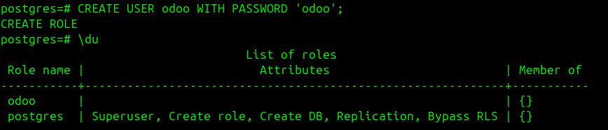

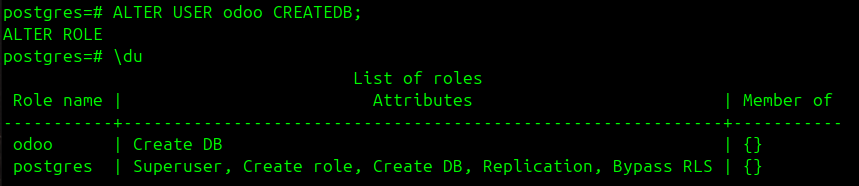

Ainsi, nous avons pu créer l'utilisateur Odoo et l'autoriser à créer une nouvelle base de données.

### Deploiement de Odoo
```bash
## Déploiement de Odoo (persitentVolume, Deployment, Service)
kubectl apply -f odoo.yaml -n icgroup
```

### Deploiement de pgAdmin
```bash
## Déploiement de pgAdmin (persitentVolume, Deployment, Service et configmap)
kubectl apply -f pgadmin.yaml -n icgroup
```
### Vérification de l'ensemble des ressources
```bash
kubectl get all -n icgroup
```
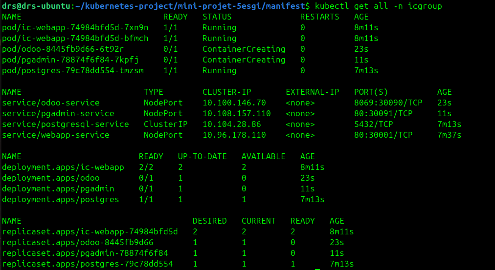

On retrouve bien toutes nos ressources créées et utilisées par notre application !
```bash
kubectl get cm -n icgroup
```
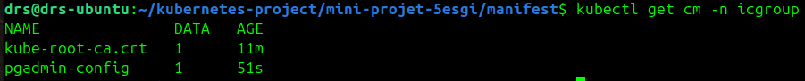

Ainsi que notre configMap !
```bash
kubectl get cm -n icgroup
```

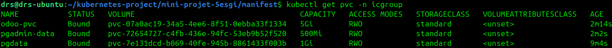

Et nos volumes !

## Vérification du fonctionnement de l'application

On peut tenter d'accéder à l'interface web de notre Odoo depuis notre navigateur :
```bash
http://192.168.59.100:30090
```
Odoo est bien joignable, on accède bien à son interface web ! On va pouvoir créer une nouvelle base de donnée :

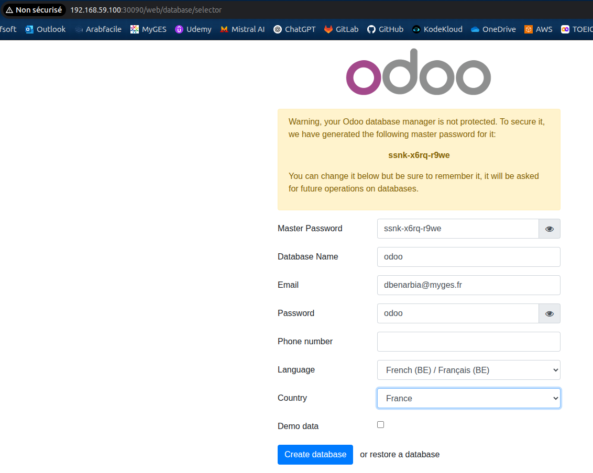

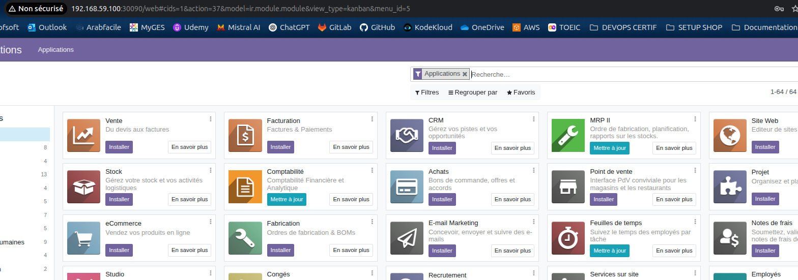

On peut effectuer la même procédure pour pgAdmin :
```bash
http://192.168.59.100):30091
```

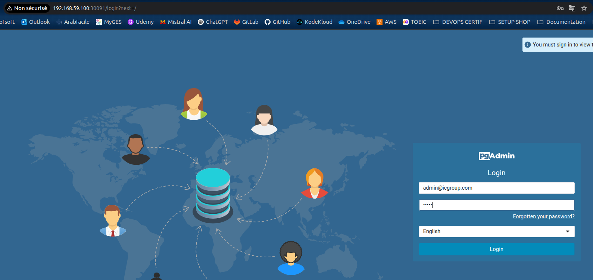

pgAdmin est bien joignable, on accède bien à son interface web ! On va pouvoir essayer de se connecter à notre base de donnée :

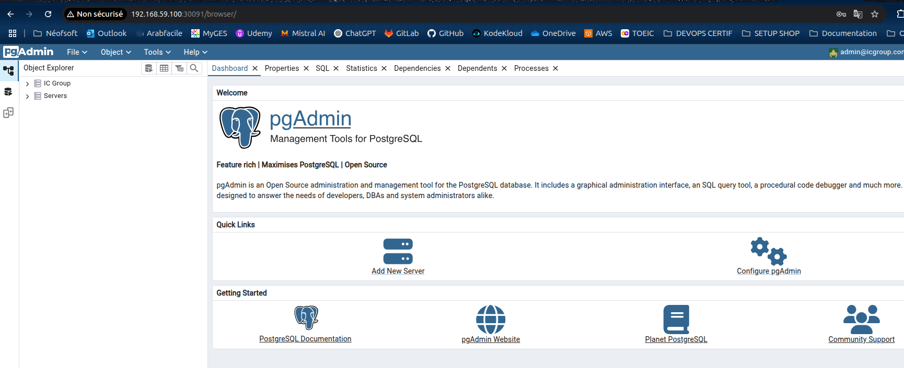

Nous sommes à présent connecté à notre base de donnée postgresql ! A présent, on va essayer de se connecter à notre base de donnée odoo avec le mot de passe que nous avons créer :

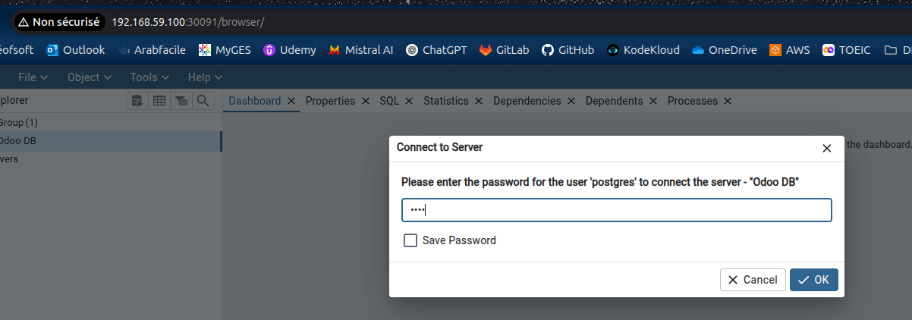

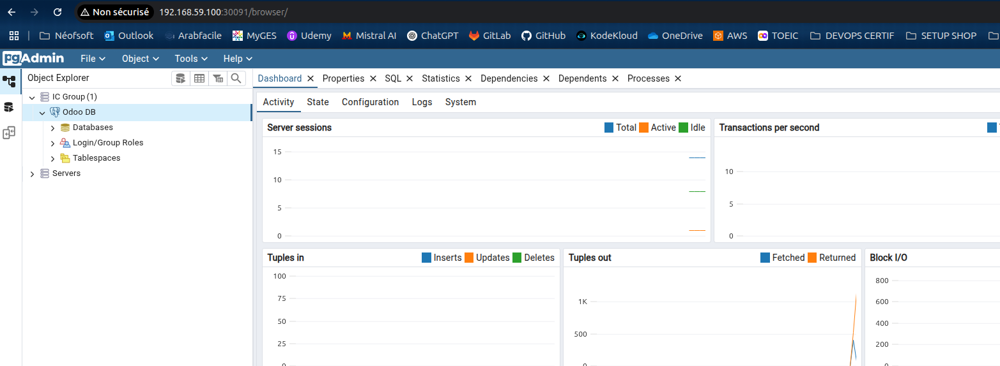

Nous sommes bien authentifié et connecté à Odoo !

A présent, nous allons voir si on arrive à joindre Odoo et pgAdmin depuis notre interface web "ic-webapp" :
```bash
http://192.168.59.100:30001
```
Voici l'interface web avec nos deux outils de disponibles accessible cette voici depuis le port 30001 :

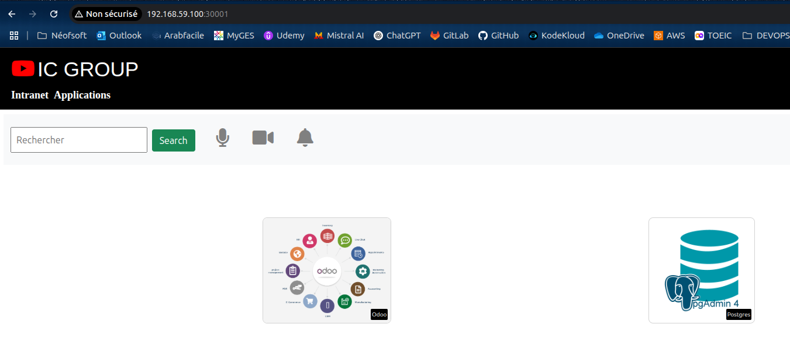


Tout est fonctionnelle ! Notre application est prête à être utilisée.


